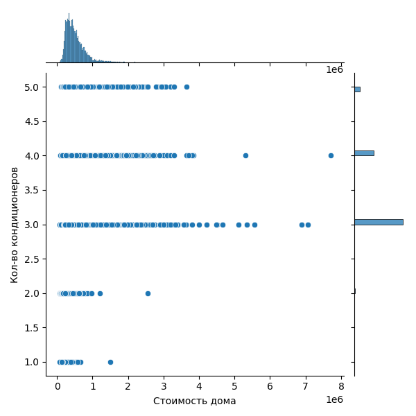

# 1.2. Изучите стоимости недвижимости

    sns.histplot(df['price'])
    plt.title('Распределение цены')
    plt.xlabel('Стоимость дома')
    plt.ylabel('Количество домов')
    plt.grid()

Наибольшее количество домов по цене ~330 тыс. Максимальная цена ~7,7 млн.
Основное количество домов по цене от 180 тыс. до 800 тыс.

# 1.3. Изучите распределение квадратуры жилой площади

    sns.histplot(df['sqft_living'])
    plt.title('Распределение кв. жилой пл.')
    plt.xlabel('Площадь дома')
    plt.ylabel('Количество домов')
    plt.grid()

Дома в основном площадью от 700 до 4 тыс. Наибольшее количество домов с площадью между 1200 и 2150.

# 1.4. Изучите распределение года постройки

sns.histplot(df['yr_built'])
plt.title('Распределение года постройки')
plt.xlabel('Год')
plt.ylabel('Количество домов')
plt.grid()

Самый старый дом 1900 года и самый молодой 2015 года. Больше всего домов 2002-2005 годов. 
Меньше всего домов 1933-1936 годов. 

# 2.1. Изучите распределение домов от наличия вида на набережную

    plt.pie(df['waterfront'].value_counts(), autopct='%1.1f%%', labels=['Без вида на набережную', 'С видом на набережную'])
    plt.title('Наличие вида на набережную')

Только 0,8% домов имеют вид на набережную.

# 2.2. Изучите распределение этажей домов

    data = df['floors'].value_counts()
    sns.barplot(data)
    plt.title('Распределение этажей домов')
    plt.xlabel('Этажность дома')
    plt.ylabel('Количество домов')

Самое большое количество домов с 1 этажом, и на втором месте по количкству дома с 2 этажами.

# 2.3. Изучите распределение состояния домов

    data = df['grade'].value_counts()
    sns.barplot(data)
    plt.title('Распределение состояния домов')
    plt.xlabel('Оценка дома')
    plt.ylabel('Количество домов')

Больше всего домов с оценкой 7 и 8.

# 3. Исследуйте, какие характеристики недвижимости влияют на стоимость недвижимости, с применением не менее 5 диаграмм из урока.

## Спальни

    sns.jointplot(x=df['price'], y=df['bedrooms'])
    plt.xlabel('Стоимость дома')
    plt.ylabel('Количество спален')

Количество спален *влияет* на стоимость дома, но не выраженно.

## Оценка

    sns.jointplot(x=df['price'], y=df['grade'])
    plt.xlabel('Стоимость дома')
    plt.ylabel('Оценка дома')

Оценка *выраженно влияет* на стоимость дома.

## Кондиционер

    sns.jointplot(x=df['price'], y=df['condition'])
    plt.xlabel('Стоимость дома')
    plt.ylabel('Кол-во кондиционеров')

Кондиционер *влияет* на стоимость дома, но не выраженно.

## Площадь дома

    sns.jointplot(x=df['price'], y=df['sqft_lot'])
    plt.xlabel('Стоимость дома')
    plt.ylabel('Площадь дома')

Площадь дома почти *не влияет* на стоимость дома.

## Этажность дома
sns.jointplot(x=df['price'], y=df['floors'])
plt.xlabel('Стоимость дома')
plt.ylabel('Этажность дома')

Этажность дома почти *не влияет* на стоимость дома.

## Вид на набережную  

    data1 = df['price'][df['waterfront']==0]
    data2 = df['price'][df['waterfront']==1]
    plt.boxplot([data1, data2], showfliers=False)
    plt.xlabel('Вид на набережную')
    plt.ylabel('Стоимость дома')
    plt.xticks([1,2], ['Нет','Есть']);

Вид на набережную *влияет* на стоимость дома.

## Год постройки

    sns.jointplot(x=df['price'], y=df['yr_built'])
    plt.xlabel('Стоимость дома')
    plt.ylabel('Год постройки')

Год постройки почти *не влияет* на стоимость дома.